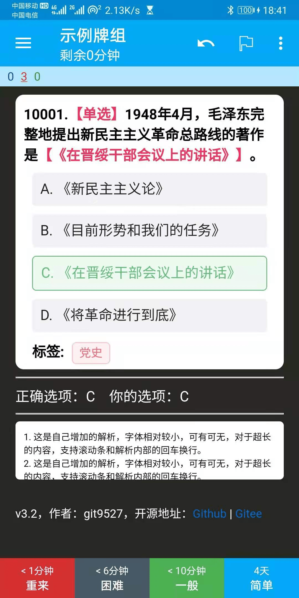
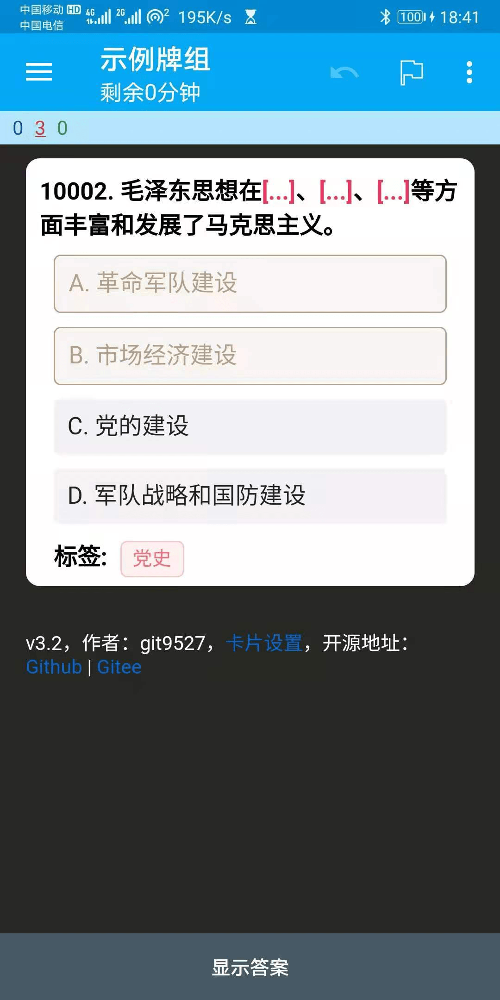

# Anki的选择题模板

## 更新日志:
v3.1:
1. 调整弹窗背景颜色，与卡片默认背景色保持一致
2. 进入卡片时，清除可能存在的已选择项
3. 增加【选项延迟】的设置项，开启后延迟500毫秒显示选项

v3.0:
1. 增加【卡片设置】功能：a).隐藏选项 b).显示类型 c).随机排序
2. 多选模式下当选择个数与答案个数相同时，自动翻转至卡片背面
3. notes调整为默认不显示，修复直接【显示答案】时的样式问题
4. 解决iOS AnkiMobile上的误触问题

v2.0:
1. 加入多选题模式，同时兼容单选/多选
2. 添加notes字段，在显示答案后出现

v1.5: 
1. 修复iOS上Anki记忆卡软件的标签显示问题
2. 修复显示答案前不能修改的问题

## 判断说明
单选/多选情况下，标示正确/错误的所有情况如下：
### 单选
|       | 正确选项 | 错误选项 |
| :---: | :----: | :----: |
| 选中   |   ✅   |  ❌    |
| 未选中 |    ✅   | 无变化  |

### 多选
|       | 正确选项 | 错误选项 |
| :---: | :----: | :----: |
| 选中   |   ✅   |  ❌    |
| 未选中 |    ❌   | 无变化  |

## 模板字段

1. id: 推荐用逐渐增加的数字，以便后续更新卡片时作为唯一性判断依据
2. question: 问题的题干部分，需要包含扣掉的{{c1::答案}}
3. options: 可选项，中间用`||`分开
4. answer: 正确答案的序号，1为第一个，2为第二个……以此类推。若为多选题，答案之间用`||`分开
5. notes: 显示答案后的解析，非必填字段

## 卡片设置

1. 隐藏选项：适用位置不变的速答题，是否将选项隐藏（仅显示第一个汉字)，记住位置
2. 随机选项：是否将选项的位置随机打乱
3. 显示类型：是否在问题前显示题目的类型（【单选】或【多选】）
4. 延迟选项：是否延迟500毫秒显示选项

## 各平台截图
|平台             | 单选 | 多选 |
|:--------------:|:----:|:----:|
|Mac             |  |  |
|Windows         |  |  |
|Ubuntu          |  |  |
|Web             |  |  |
|Android         |  |  |
|iOS - AnkiMobile|  |  |
|iOS - Anki记忆卡 |  |  |

