# Anki选择题模板

## 最新示例卡片下载地址
https://zhangsn.me/anki-awesome-select/

## 更新日志:
v3.12:
1. 重构代码，对于想关闭的同学，可以直接将卡片正面源码中的`var DEFAULT_AUTO_FLIP = '1'`中的`1`改为`0`

v3.11:
1. 增加【自动翻转】的设置项，用于关闭自动翻转的功能，默认开启

v3.10:
1. 微调选项前面序号的位置，使其与对错图标居中对其
2. 优化安卓客户端【卡片浏览器】展示，隐藏非重要信息
3. 增加LaTex相关示例，示例编号10004

v3.9:
1. 解决Android客户端翻转至卡片背面时的选项闪动问题

v3.8:
1. 解决Android客户端翻转至卡片背面时的题干闪动问题

v3.7:
1. 未做选择，直接显示答案时，你的选项将提示【未选择】

v3.6:
1. 当设置里【显示类型】为开启状态时，卡片背面才将问题类型在题目前显示

v3.5:
1. 样式调整，提高未选中选项的辨识度
2. 将延时时间从500毫秒增加到1500毫秒

v3.4:
1. 修复当解析里仅含图片时不显示的问题
2. 自动计算并调整最合适的解析框高度
3. 增加【隐藏解析】的设置项，开启后，碰到有解析的卡片，先出现【显示解析】的按钮，点击按钮后才出现解析 

v3.3:
1. 正确，错误，提示三种选项前新增小图标
2. 默认模式调整为淡色模式，新增【纯色模式】，用于切换
3. 适当增加解析部分的字号和高度
4. 修复iOS Anki记忆卡上直接显示答案时，【你的选项】为@的问题
5. 修复iOS Anki记忆卡上解析部分字体偏粗的问题

v3.2:
1. 选中的选项主色调由黄色调整为棕色
2. ⚠️多选模式下，未选择但正确的选项标示为黄色
3. 优化解析部分的展示，对于超长的内容，支持滚动条和解析内部的回车换行。
4. 增加【淡色模式】的设置项，用于默认的浓色和淡色切换
5. 调整设置项顺序

v3.1:
1. 调整弹窗背景颜色，与卡片默认背景色保持一致
2. 进入卡片时，清除可能存在的已选择项
3. 增加【选项延迟】的设置项，开启后延迟500毫秒显示选项

v3.0:
1. 增加【卡片设置】功能：a).隐藏选项 b).显示类型 c).随机排序
2. 多选模式下当选择个数与答案个数相同时，自动翻转至卡片背面
3. notes调整为默认不显示，修复直接【显示答案】时的样式问题
4. 解决iOS AnkiMobile上的误触问题

v2.0:
1. 加入多选题模式，同时兼容单选/多选
2. 添加notes字段，在显示答案后出现

v1.5: 
1. 修复iOS上Anki记忆卡软件的标签显示问题
2. 修复显示答案前不能修改的问题

## 判断说明
单选/多选情况下，标示正确/错误的所有情况如下：
### 单选
|       | 正确选项 | 错误选项 |
| :---: | :----: | :----: |
| 选中   |   ✅   |  ❌    |
| 未选中 |    ✅   | 无变化  |

### 多选
|       | 正确选项 | 错误选项 |
| :---: | :----: | :----: |
| 选中   |   ✅   |  ❌    |
| 未选中 |    ⚠️   | 无变化  |

## 模板字段
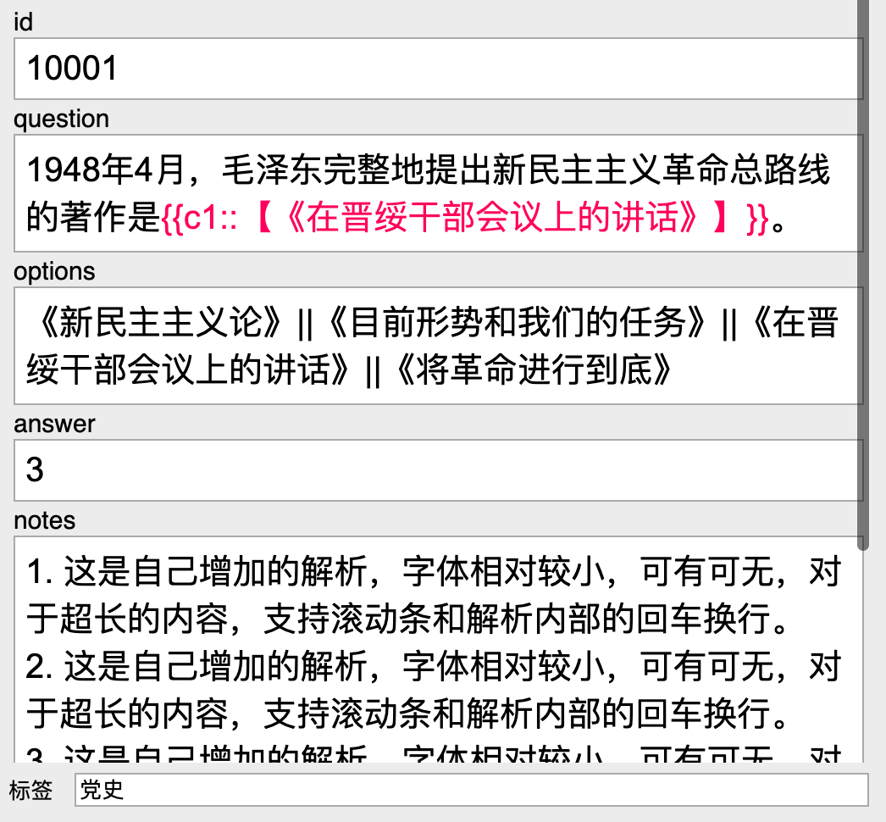
1. id: 推荐用逐渐增加的数字，以便后续更新卡片时作为唯一性判断依据
2. question: 问题的题干部分，需要包含扣掉的{{c1::答案}}
3. options: 可选项，中间用`||`分开
4. answer: 正确答案的序号，1为第一个，2为第二个……以此类推。若为多选题，答案之间用`||`分开
5. notes: 显示答案后的解析，非必填字段

## 卡片设置
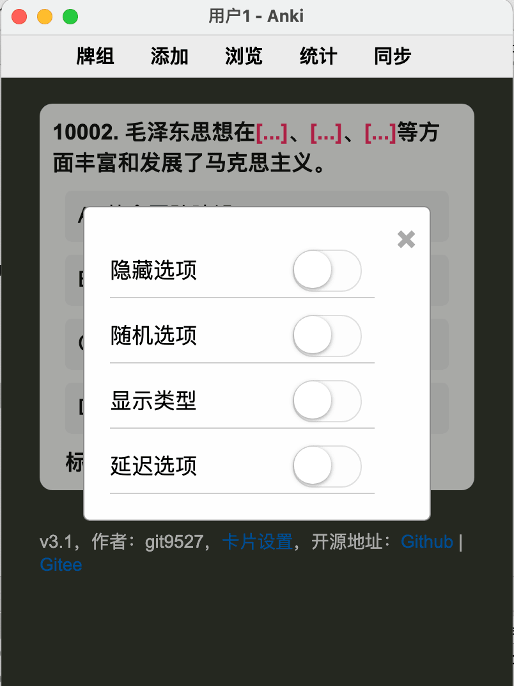
1. 显示类型：是否在问题前显示题目的类型（【单选】或【多选】）
2. 隐藏选项：适用位置不变的速答题，是否将选项隐藏（仅显示第一个汉字)，记住位置
3. 随机选项：是否将选项的位置随机打乱
4. 延迟选项：是否延迟1500毫秒显示选项
5. 纯色模式：用于默认的淡色和纯色切换
6. 隐藏解析：开启后，碰到有解析的卡片，先出现【显示解析】的按钮，点击按钮后才出现解析
7. 自动翻转：默认开启，当选择数量与答案数量一致时，翻转至卡片背面

## LaTex公式输入
1. 公式里的所有` \ `都需要替换成 `\\`
2. 公式前后用`\\(`和`\\)`包裹起来
3. 详细示例见示例牌组的`10004`

## 各平台截图
|平台             | 单选 | 多选 |
|:--------------:|:----:|:----:|
|Mac             |  | 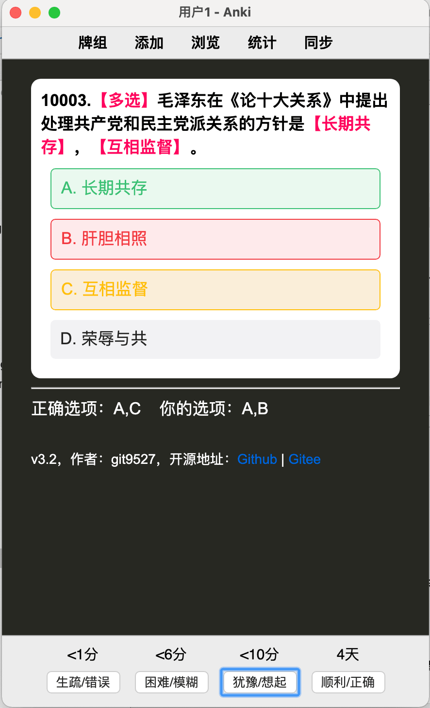 |
|Windows         | 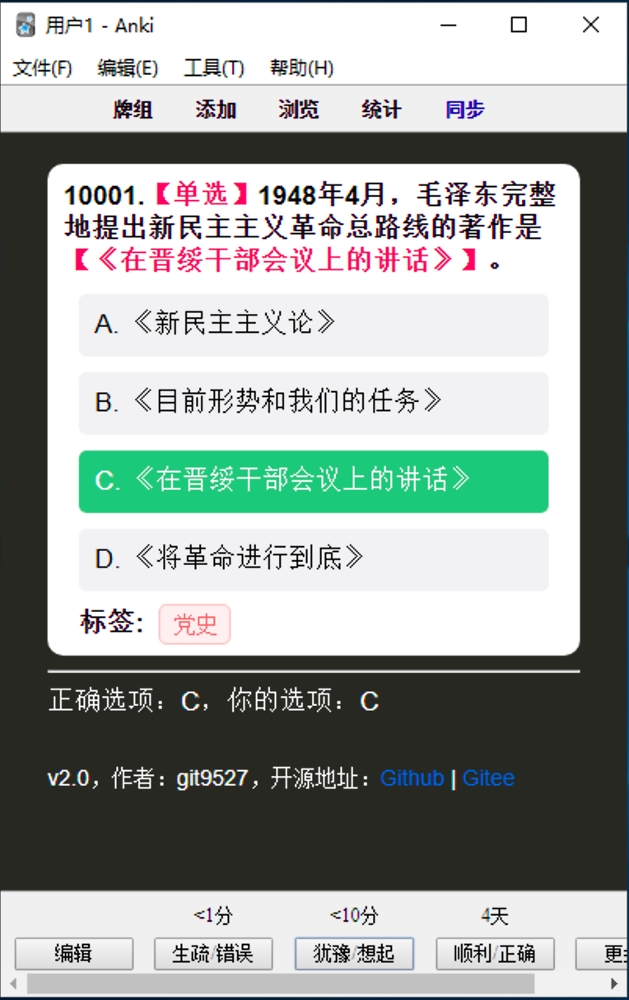 | 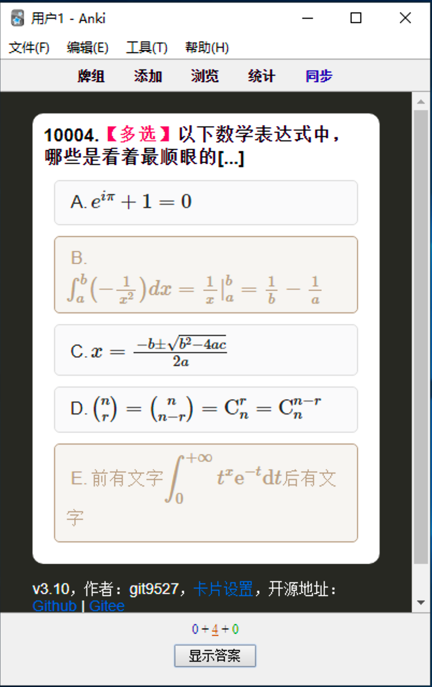 |
|Ubuntu          | 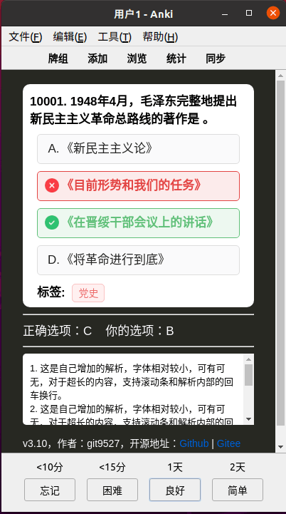 | 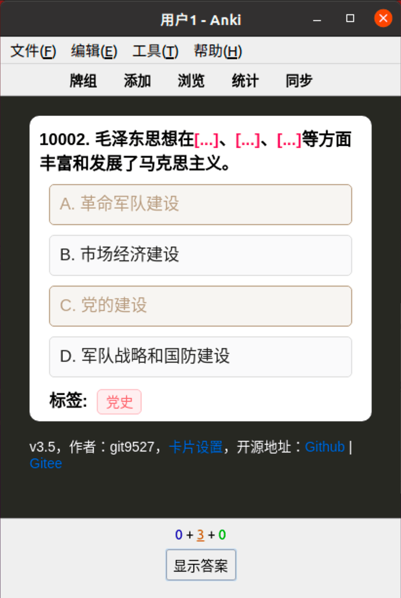 |
|Web             | 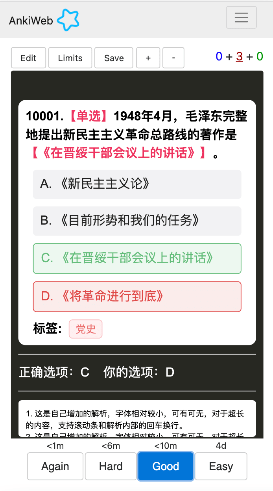 | 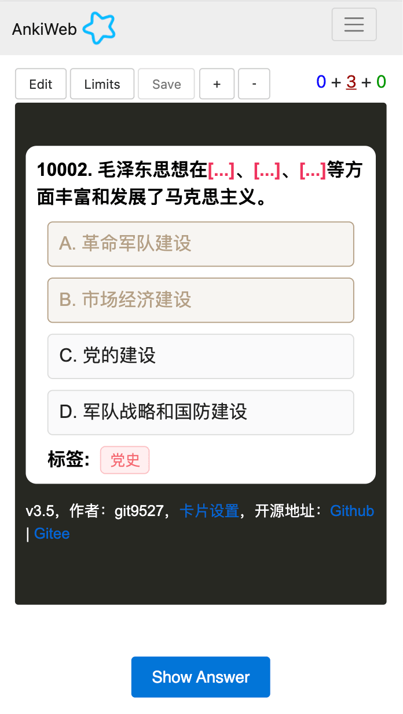 |
|Android         | 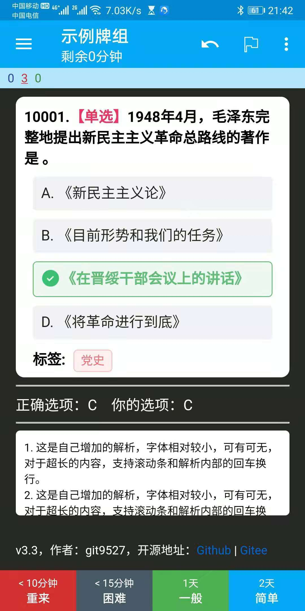 | 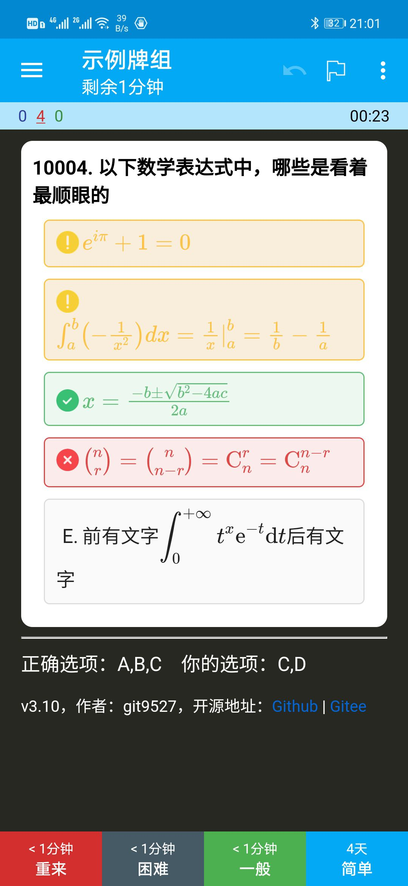 |
|iOS - AnkiMobile| 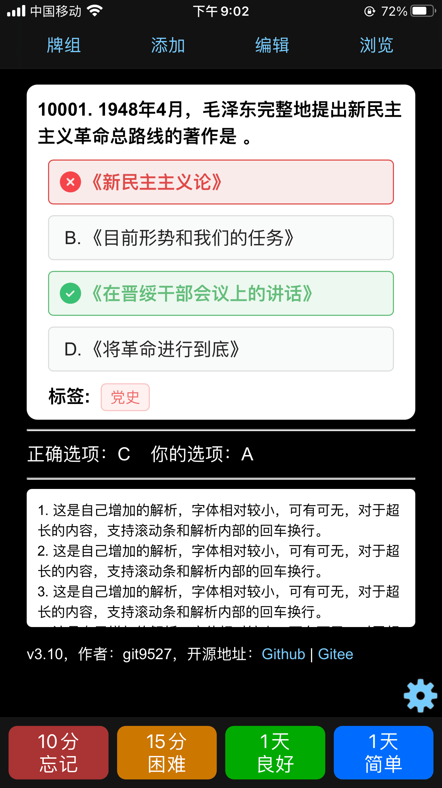 | 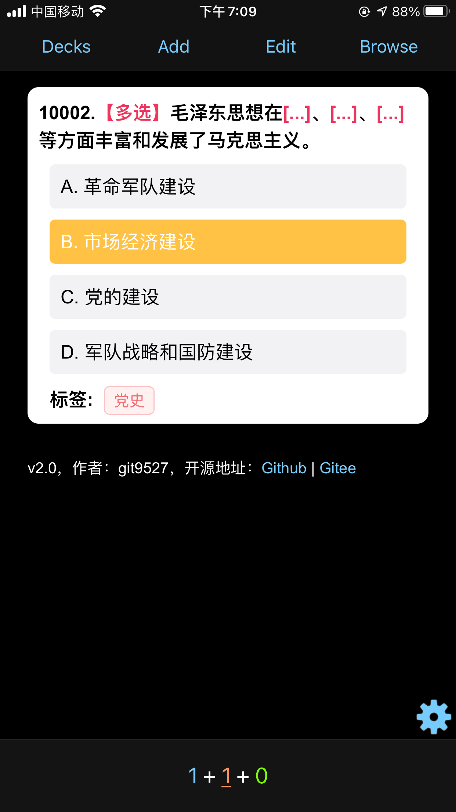 |
|iOS - Anki记忆卡 | 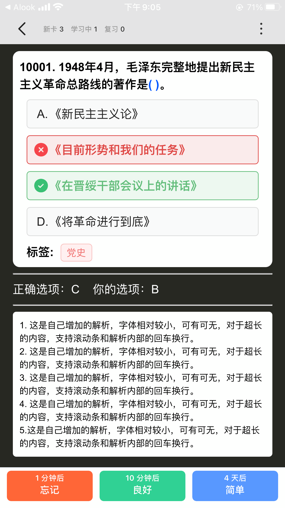 | 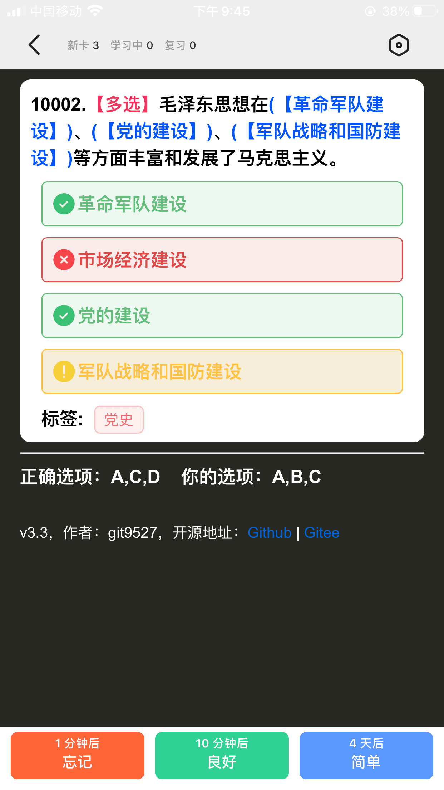 |

